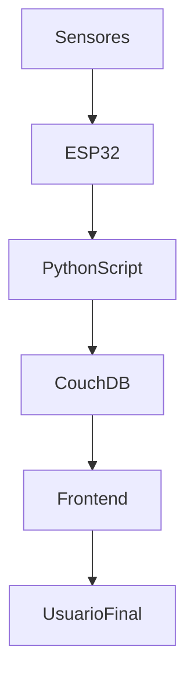

# 🌊 FloodGuard – Sistema de Monitoramento de Enchentes

O **FloodGuard** é um sistema completo de monitoramento de enchentes desenvolvido para operar totalmente **offline**, com base em sensores físicos conectados a um microcontrolador **ESP32**, integrados a uma aplicação web moderna construída com **React + TypeScript + Vite**.

---

## 🚀 Funcionalidades

- 📶 Leitura em tempo real dos sensores de **nível de água** (HC-SR04) e **chuva** (analógico)
- 🔄 Envio dos dados via **USB serial** diretamente ao banco **CouchDB local**
- 💻 Interface de dashboard local com **visualização gráfica**
- 📈 Gráfico de nível da água
- 🚨 Alerta de status quando o nível se aproxima do limite
- 🌤️ Bloco de previsão do tempo (mock)
- 🔒 Totalmente funcional **sem acesso à internet**

---

## 🧱 Arquitetura do Sistema



---

## 🔌 Tecnologias Utilizadas

| Camada       | Tecnologia                      |
|--------------|----------------------------------|
| Microcontrolador | ESP32                          |
| Sensores     | HC-SR04 (nível), analógico (chuva) |
| Backend      | Python (serial + requests)       |
| Banco de dados | CouchDB (NoSQL local)            |
| Frontend     | React + TypeScript + Vite        |
| Estilo       | CSS Modules                      |
| Gráficos     | Recharts                         |

---

## ⚙️ Como rodar o projeto

### 1. Clone o repositório
```bash
git clone https://github.com/vicmariucha/flood-guard.git
cd flood-guard
```

### 2. Instale as dependências
```bash
npm install
```

### 3. Rode a aplicação
```bash
npm run dev
```

### 4. Verifique se o script Python está rodando
Certifique-se de que o script `enviador_serial_couchdb.py` está enviando os dados corretamente para o CouchDB.

---

## 💾 Estrutura de Diretórios

```
flood-guard/
├── public/
├── src/
│   ├── components/      # Componentes visuais
│   ├── pages/           # Página principal (Dashboard)
│   ├── services/        # Comunicação com o CouchDB
├── enviador_serial_couchdb.py  # Script de envio de dados via serial
├── README.md
```

---

## 🧪 Requisitos

- Node.js + npm
- Python 3.x com `pyserial` e `requests`
- CouchDB instalado localmente (porta 5984)
- ESP32 conectado à máquina via USB

---

## 📦 Próximos passos

- Conectar API real de clima (OpenWeather)
- Registrar histórico de dados e exibir
- Criar Progressive Web App
- Enviar alertas via email ou WhatsApp

---

## 🧑‍💻 Autor

Desenvolvido por **Gustavo Argoze e Victória Mariucha** – .

---
